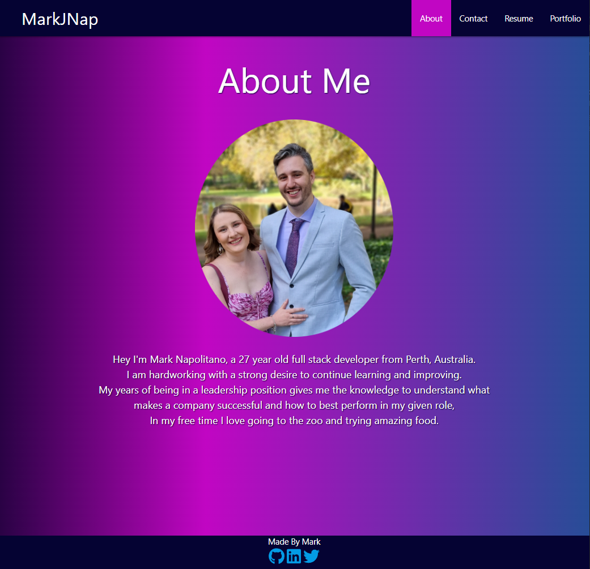

# React Portfolio

## Description

This is my first attempt at creating a React portfolio, React is an incredibly powerful tool for developing and I really learnt a lot in the creation process. This site will act as a tool for displaying my projects and applying for jobs. I took advantage of using individual components and creating css module files so that I would have no problems keeping components seperate. I also used Materialize CSS for helping with styling parts of the layout. I will continue to work on this project as my skills improve to reflect that.

## Installation

Has no installation required visit the deployed site here:
https://markjnap.github.io/react-portfolio/

## Usage

This site has 4 different tabs;
* An about page with an image and a short description of myself
* A contact page with my email and a form to get in contact with me (This currently does nothing as this has no back end attached.)
* A Resume page with a download button to receive a copy of my resume and a short list of my skills
* And a Portfolio page with 6 of my projects listed with an image and links to their Github repos and to where they are hosted.

Demo Image:

## Credits

Mark Napolitano

## License

ISC License

---